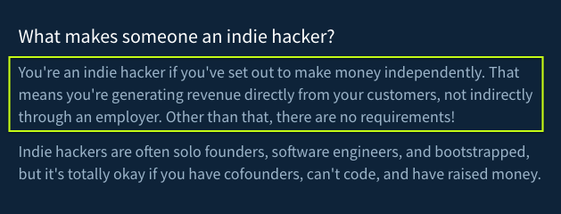
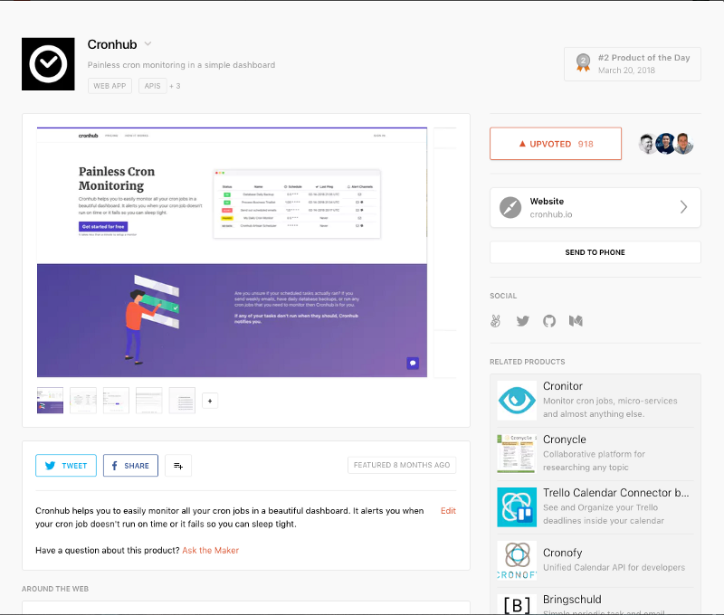
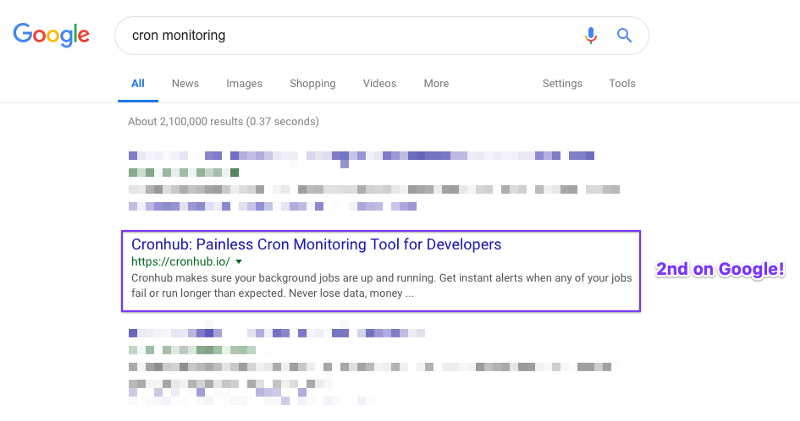
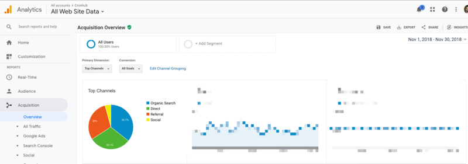

<figcaption>Spent a week in Wells, VT to disconnect from work and reflect on all the things!.</figcaption>

My name is Tigran and by definition, I’m probably a half-indie hacker. Why half you may ask? Because I’m a full-time software engineer at Buffer but at the same time I’m building an online profitable side-business called [Cronhub](https://cronhub.io/).

If we think how one of my favorite Internet sites, [Indie Hackers](http://www.indiehackers.com/) defines it, I think I fit into that definition but not quite.

<figcaption>How IndieHackers.com defines indie hacker</figcaption>

I generate money independently through the product I’ve created but also have a primary source of income which is my employer. I’m a solo founder and have been bootstrapping Cronhub for the past 8 months or so. As you see I may have the rights to call myself an indie hacker, right? If your answer is yes then let’s read my story further. Also, I’ve written [another article](https://blog.cronhub.io/reflections-on-being-a-remote-developer/) if you like to read more about how I work remotely.

I wanted to be an indie hacker for multiple reasons but the biggest motivation has always been my passion for building products. In the past, I’ve built other [side-projects](http://tigranhakobyan.com/projects) that were free. I even created a side-project when I was studying at Rochester Institute of Technology (RIT) called Wheelie. It became the official ride-sharing online platform for RIT students. However, I’ve shut it down two years ago due losing my interest for the product as well as worrying too much about safety issues. So yes, I love side-projects because it’s fun and you get to learn a wide range of skills.

Another reason why I started Cronhub is financial income. I understand that money doesn’t necessarily buy happiness but it can buy freedom and I think it’s a big deal at least for me. Not having enough money is always very stressful and making money is usually more fun.

For the past year or so I’ve started to value my time a lot and decided if I ever get involved in side-projects it won’t be for free. Having a full-time job and a family doesn’t give you too much free time so I better justify what I spend my time on. This thinking really changed my perspective on things that I was keen to work on. This article is a reflection of that journey.

## The motivation behind this article
The motivation for writing this article is primarily based on wanting to share my knowledge and experience with others who are thinking of becoming an indie hacker. When I started this journey I always enjoyed reading other people’s stories, how they came up with an idea, how they ran their businesses and what it was like being an indie hacker.

Unfortunately, there isn’t a universal formula that one can share for building a successful business. Even the word “successful” has a different meaning for different people. One may define success by revenue and others care about other metrics.

Thus, my goal is not to give any advice but rather openly share everything I’ve learned and experienced throughout this year so you can make your own conclusions. I also want to encourage other indie hackers to write about their stories because having more data points only helps people who want to get started with building their own products and making money independently.

The Internet has become the most innovative medium to meet like-minded people, read stories and get inspired by them. Inspiration and motivation are two great forces that fuel your mind to achieve your goals and dreams. So I hope I can motivate you even a little bit with this article. If I do, then my time writing this article is fully justified.

## Launch
Starting my own business and having side-income has been on my mind for a long time. Since I changed my perspective about side-projects I knew that if I was going to dedicate my time to building something it wouldn’t be free.

Getting paid for my own products was never about quitting my full-time job. I know many indie hackers whose main motivation is to become independent and not work for anyone. I can see that view and respect it. However, I enjoy my current job at Buffer and have no plans to leave it anytime soon. Will I ever work for myself full-time? I don’t know yet.

Coming up with an idea that can turn into a business wasn’t as hard as I imagined. I had a couple of requirements which I used to run my ideas over for evaluation.

For each idea I asked the following questions:

- Is this the idea for the market I’m familiar with?
- Is this product solving my own problem?
- Can I charge for this product?
- Is this something I’m passionate about?

At the end only two ideas made it to the last step:

1. An online course on how to build a SaaS product with Laravel and Vue.js
2. An easy Cron monitoring tool for developers

I ended up choosing the second option above only because I knew it would take me less time to launch the MVP compared to making an online course.

I’ve never done any online course before so I knew it would take quite a lot of time to finish it. I told myself I was going to give this idea a try and if it didn’t work out then I was going to step back and focus only on creating educational materials for developers. I knew there would always be a demand for those type of products.

Cron monitoring has always been very tricky and challenging. At Buffer I deal with many cron jobs and need to make sure they run on time and if they fail I want to be aware of it. Before Buffer when I was at YCharts I created a custom dashboard for the team to track all internal scheduled jobs. The dashboard would contain the list of the scheduled jobs and some logs.

However, the way we would know whether the jobs ran or not was by looking at the internal dashboard. This meant that we had to check the dashboard every single day to make sure all the checks have passed. This wasn’t ideal.

When I talked to other developers I realized that this pattern repeats in many engineering teams. So this was a big signal for me of an existing problem. So I decided to build a product that makes it a breeze to monitor Cron jobs. If I could build it, I could use it for my side-projects and Buffer.

After working on the first version of the product for almost 2 months (part-time) I [launched Cronhub on Product Hunt on March 20, 2018](https://www.producthunt.com/posts/cronhub). The reaction of the PH community was quite positive and this set the beginning of my indie hacker journey.

<figcaption>Cronhub’s listing on ProductHunt</figcaption>

Launching a new product is a great milestone to hit but what comes after that is probably what most people struggle with. Growing your product and finding a product-market fit is a big challenge especially for first time founders.

## Growing and attracting users
Trying to grow a business on the side comes with many challenges. Obviously, time is the biggest constraint but figuring out what to work on is another one that most founders face. Early on when you don’t have many users or customers it’s really hard to rely on data and make data-driven decisions. So the only option left is either seek advice from other founders or follow your own intuition.

Most of the product based decisions early on were based on my own intuition. Since I was building Cronhub for myself I knew exactly the features I needed to focus on. Being your own user is a big advantage and I strongly believe the idea of solving your own problem is really on point.

After launching your own product, you usually end up doing two things:

1. Iterating on the product
2. Selling your product

Most developers I know including myself are good at iteration but kind of suck at selling and marketing. I had no knowledge of sales so I focused on marketing instead.

I decided the way I was going to attract users and acquire customers is content marketing. Not only do I enjoy writing but I also knew that it had great long-term SEO benefits. It helps to grow your audience and get more exposure.

After following all the basic SEO guides and publishing articles I was able to bring Cronhub to the first page of Google under certain keywords such as “cron monitoring”. It jumped from the 6th page to the second search result within months after me sharing articles on the blog.

Checking Cronhub’s Google Analytics data for November 2018, organic search was the biggest acquisition channel. So I think writing really pays off if you enjoy it.

<figcaption>Jumped to the first page for certain keywords!</figcaption>

However, content marketing is very time-consuming so it’s hard and sometimes not sustainable for a solo founder. Making it your primary marketing channel requires you to dedicate a ton of time on writing.

I started to think about different distribution channels that could work for Cronhub. One of them is Github marketplace which I’m currently working on. With this, I hope I can get more exposure to developers. I will share my experience after launching Cronhub on Github Marketplace in a different article so stay tuned.

## Current growth
For the past few months, growth has been slow but partially meeting my own expectations, if I take into account the time I spend on Cronhub. November has been the highest revenue month when I hit around $620 in revenue.

I do want to speed up growth and increase revenue but I think that requires changing my strategy. First, I need to understand who my ideal customer is and If I’m targeting developer teams then I should narrow it down further. It will help me to create a plan to bring more relevant users to Cronhub and increase the conversion rate.

Apart from bringing more leads to the site, I want to improve the onboarding process for new users. New users should be able to easily integrate their system jobs with Cronhub monitors. I usually have around 7 - 10 signups every day but only 2 - 3 of them actually activate monitors.

In order to increase the activation, I want to eliminate the manual work it requires. For this purpose, I’m building a new CLI tool that developers can run on their servers to easily hook up their cron jobs with Cronhub monitors. I’m very excited about this tool and can’t wait to release the first version next year.

Another small addition that helped me increase the number of sign-ups was supporting Github authentication. It took me less than a day to get it done but as of now almost half of my new users choose to sign up with Github. It’s a different concern whether those users have a higher conversion rate or not.

## Reflections
Writing articles like this is really a great way to reflect on your past journey. I feel like writing in a way is a meditation where you try to control your thoughts and direct them into a single purpose - writing.

So here I’ll try to write down everything that comes to my mind, everything that is worth sharing with you. These reflections are solely based on my experience of building a side-business while working full-time. The reason why I emphasize this is because it can be very different from someone who is working full-time on their own project.

When I meet new people in person or online and tell them about my side-project they keep asking me about how I manage to find time to work on anything else other than my job. My answer has been the same for the past year. I spend very little time but do it every day. It can be an hour or two hours but no more than that. After doing the same work every day it gets easier over time and it becomes a habit.

When I know I have only 1 - 2 hours every day to work on Cronhub I get very strict about things I should work on. I usually break down my tasks so that I can finish them in a day. I know if it goes beyond a day or two I’m going to abandon it. It’s tough but it happens to me every single time. I keep my tasks small and that helps me get things done.

There are some days when I feel down and just want to watch Netflix. I believe this happens to everyone and I noticed there is a pattern in my case. When I don’t get new customers for 2 weeks or so I lose my motivation because I think growth has stopped. When this happens I try to encourage myself to have the patience or sometimes open a new Dropbox Paper and write down some ideas that can help me accelerate the growth.

I miss having a co-founder sometimes. I need someone to bounce my ideas off or ask for advice. It also helps with motivation. When you share your concerns with someone who really cares and gets the context it helps because when you share you suddenly feel a lot better.

Will I ever try to find a co-founder for Cronhub? Maybe. I thought about this a lot and obviously, I don’t want a co-founder just for helping me feel better. 🙂

I do want to fully define that role before I start actively looking for one. I also need to understand the trade-offs of having a co-founder versus staying solo.

Customer support and pricing is something I wonder a lot about as well. How one affects another? I think it does in some way. If I’m considering running my business alone for a long time I need to define the type of customers I want to serve.

I can have many low-touch customers or few high-touch customers. I don’t want to spend too much time on customer support because I won’t have time left for product work. I think it’s better for me to focus on high-touch customers and focus on serving teams. On the other hand, targeting high-touch businesses suggests that I should start working on sales and it really scares me.

Product-market fit always gets me. How does one define finding a product-market fit? Or how do you know if you found one? I [read](https://a16z.com/2017/02/18/12-things-about-product-market-fit/) about these topics a lot but it’s still unclear for me how you apply the theory in practice. One signal that maybe tells me that I have yet to find a product-market fit is slow growth.

Thus, I want to keep working on the product, make it better and only then hit the growth pedal. I’d like to learn more about the symptoms that people look for when thinking about product-market fit.

While working on Cronhub for the past year I discovered my strong passion for helping developers. I realized how much I love and enjoy building tools for developers. Improving developer productivity even with a small margin is a big deal and has a strong business value if you look at it on the company level.

Even 5% developer productivity increase can play a huge role in any company and directly impact the value that business delivers. This realization helped me to shape my professional vision - I want to help developers be more productive. I’m currently defining the “How” part.

I found a great report, The Developer Coefficient by Stripe that conducted a study with thousands of C-level executives and developers across 30+ industries. One of the survey questions was the following:

**How much of a priority is it for upper management to increase the productivity of its developers?**

**And the answer was 96%.**

Then I started to think about the environment where I could maximize my impact on developers. How can I have a bigger impact? It’s really hard to answer but I’ve been thinking about this for a while now. I can work for myself in the long run by becoming an entrepreneur or have an employer where I can build a career. Right now, I have taken the hybrid approach where I do both but I’m curious to see how this evolves over time. Maybe it’s a story for another time.

Thanks for reading. If you’re a developer who is using cron jobs or any scheduled tasks then try [Cronhub](https://cronhub.io). It’d mean a lot to me if you could share the word. Thank you!

I also want to thank my wife Ani for helping me to edit this article. ❤️
